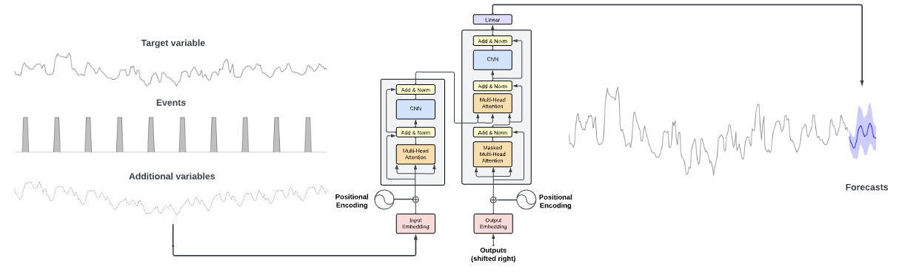

## Global models and transfer learning

### Papers

| link | description |
| ---- | ----------- |
| [TimeGPT-1](https://arxiv.org/abs/2310.03589) |  |
| [Large Language Models Are Zero-Shot Time Series Forecasters](https://arxiv.org/pdf/2310.07820.pdf) | By encoding time series as a string of numerical digits, we can frame time series forecasting as next-token prediction in text. Developing this approach, we find that large language models (LLMs) such as GPT-3 and LLaMA-2 can surprisingly zero-shot extrapolate time series at a level comparable to or exceeding the performanceof purpose-built time series models trained on the downstream tasks |
| [N-BEATS: Neural basis expansion analysis for interpretable time series forecasting](https://arxiv.org/abs/1905.10437) |  |
